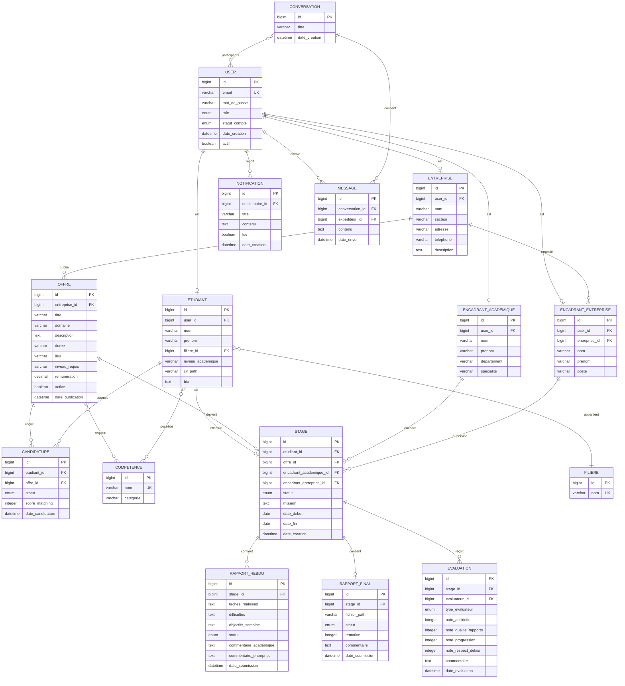
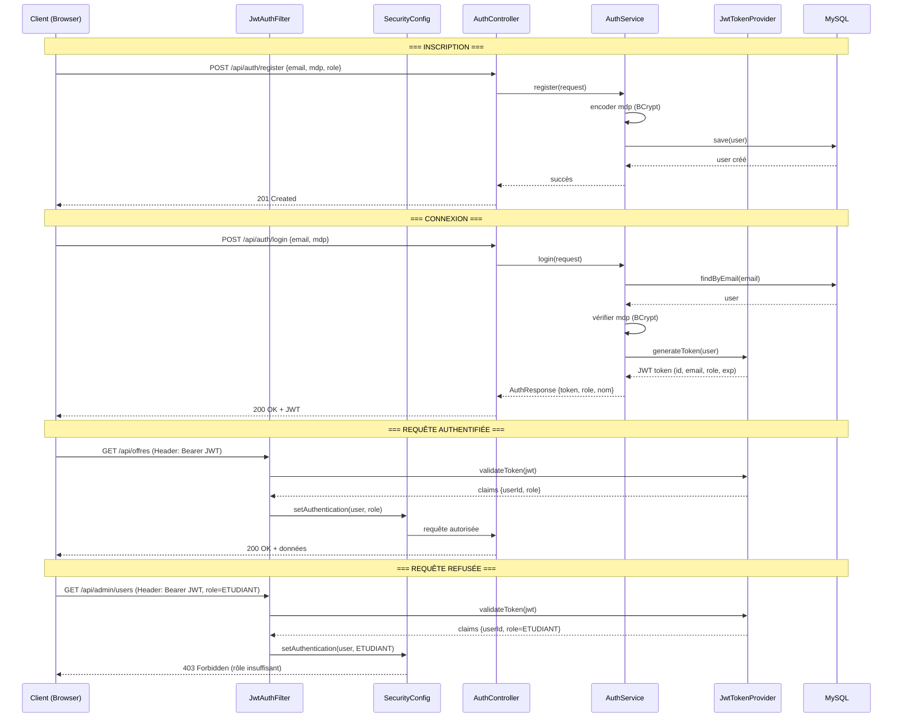
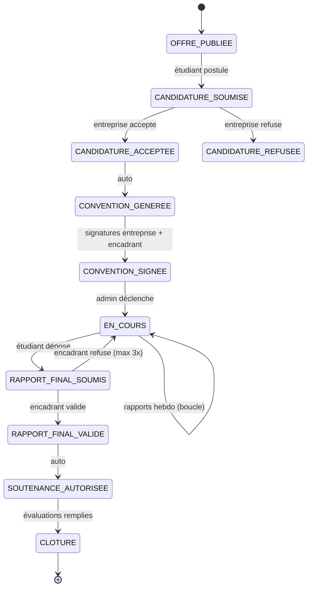

# Architecture Decision Document - SmartIntern AI

**Auteur :** Djazi
**Date :** 2026-03-20
**Projet :** PFA -- Iteam University (Tunisie)

_Ce document définit l'architecture technique de SmartIntern AI pour garantir une implémentation cohérente et structurée._

---

## Analyse du Contexte Projet

### Vue d'ensemble des exigences

**Exigences fonctionnelles :**
55 FRs organisées en 10 domaines : Authentification & Utilisateurs (FR1-FR8), Profils & Compétences (FR9-FR12), Offres de Stage (FR13-FR16), Recherche & Candidature (FR17-FR23), Matching Intelligent (FR24-FR26), Suivi Pédagogique (FR27-FR35), Évaluation (FR36-FR38), Gestion Documentaire (FR39-FR45), Dashboard & Statistiques (FR46-FR48), Détection à Risque (FR49-FR50), Notifications (FR51-FR52), Administration (FR53-FR55).

**Exigences non fonctionnelles :**
Sécurité (JWT, bcrypt, isolation par rôle), Performance (pages < 3s, PDF < 5s), Fiabilité (machine d'états sans transition invalide, transitions atomiques), Maintenabilité (architecture en couches Spring Boot, schéma documenté).

**Complexité & Échelle :**

- Domaine principal : Application web full-stack (client-serveur REST)
- Niveau de complexité : Medium (5 rôles, machine d'états 12 transitions, 5 types PDF)
- Composants architecturaux estimés : ~15 modules métier

### Contraintes Techniques

- Stack imposée : Java 17+ / Spring Boot 3.x / MySQL 8.x / JWT
- Frontend : HTML / CSS / JavaScript (vanilla, pas de framework SPA)
- Architecture monolithique -- pas de microservices
- Déploiement local (pas de cloud)
- Desktop-first, pas d'exigence responsive stricte
- Jeu de données de démo pour soutenance PFA

### Préoccupations Transversales

- Sécurité et permissions par rôle sur chaque endpoint
- Notifications in-app pour tous les événements clés
- Transitions automatiques d'états (annulation candidatures, génération documents)
- Génération PDF avec tampon image
- Machine d'états du stage (coeur de la logique métier)

---

## Architecture Globale

### Vue d'ensemble Client-Serveur

```
┌──────────────────────────────────────────────────┐
│                   CLIENT (Navigateur)             │
│         HTML / CSS / JavaScript (vanilla)         │
│    Pages statiques + appels fetch vers API REST   │
└────────────────────┬─────────────────────────────┘
                     │ HTTP / HTTPS
                     │ (JSON + JWT Bearer Token)
┌────────────────────▼─────────────────────────────┐
│              SPRING BOOT (Monolithe)              │
│                                                   │
│  ┌─────────────┐  ┌──────────────┐  ┌──────────┐│
│  │ Controllers  │→│  Services     │→│Repository ││
│  │ (REST API)   │  │ (Logique     │  │ (JPA/    ││
│  │              │  │  métier)     │  │  MySQL)  ││
│  └─────────────┘  └──────────────┘  └──────────┘│
│                                                   │
│  ┌─────────────┐  ┌──────────────┐  ┌──────────┐│
│  │ Security    │  │ WebSocket    │  │ PDF      ││
│  │ (JWT Filter)│  │ (Messagerie) │  │ Generator││
│  └─────────────┘  └──────────────┘  └──────────┘│
└────────────────────┬─────────────────────────────┘
                     │ JDBC
┌────────────────────▼─────────────────────────────┐
│                  MySQL 8.x                        │
│          Base de données relationnelle            │
└──────────────────────────────────────────────────┘
```

**Approche frontend :** Pages HTML statiques dans `src/main/resources/static/` qui appellent l'API REST via `fetch()`. Séparation claire front/back via API JSON.

### Architecture 3 Couches Spring Boot

| Couche | Responsabilité | Annotations |
|---|---|---|
| **Controller** | Réception HTTP, validation entrée, réponse JSON | `@RestController`, `@RequestMapping` |
| **Service** | Logique métier, orchestration, transitions d'états | `@Service`, `@Transactional` |
| **Repository** | Accès données, requêtes JPA/JPQL | `@Repository`, extends `JpaRepository` |

**Règle stricte :** Les Controllers n'accèdent JAMAIS directement aux Repositories. Tout passe par la couche Service.

---

## Structure du Projet Spring Boot

```
smartintern-ai/
├── pom.xml
├── README.md
├── .gitignore
├── .env.example
│
├── src/
│   ├── main/
│   │   ├── java/com/smartintern/
│   │   │   │
│   │   │   ├── SmartInternApplication.java
│   │   │   │
│   │   │   ├── config/
│   │   │   │   ├── SecurityConfig.java
│   │   │   │   ├── WebSocketConfig.java
│   │   │   │   ├── CorsConfig.java
│   │   │   │   └── AppConfig.java
│   │   │   │
│   │   │   ├── security/
│   │   │   │   ├── JwtTokenProvider.java
│   │   │   │   ├── JwtAuthenticationFilter.java
│   │   │   │   └── CustomUserDetailsService.java
│   │   │   │
│   │   │   ├── controller/
│   │   │   │   ├── AuthController.java
│   │   │   │   ├── UserController.java
│   │   │   │   ├── OffreController.java
│   │   │   │   ├── CandidatureController.java
│   │   │   │   ├── RapportController.java
│   │   │   │   ├── EvaluationController.java
│   │   │   │   ├── DocumentController.java
│   │   │   │   ├── StageController.java
│   │   │   │   ├── NotificationController.java
│   │   │   │   ├── MessageController.java
│   │   │   │   ├── DashboardController.java
│   │   │   │   └── CompetenceController.java
│   │   │   │
│   │   │   ├── service/
│   │   │   │   ├── AuthService.java
│   │   │   │   ├── UserService.java
│   │   │   │   ├── OffreService.java
│   │   │   │   ├── CandidatureService.java
│   │   │   │   ├── MatchingService.java
│   │   │   │   ├── RapportService.java
│   │   │   │   ├── EvaluationService.java
│   │   │   │   ├── DocumentService.java
│   │   │   │   ├── StageService.java
│   │   │   │   ├── NotificationService.java
│   │   │   │   ├── MessageService.java
│   │   │   │   ├── DashboardService.java
│   │   │   │   ├── RisqueService.java
│   │   │   │   └── FileStorageService.java
│   │   │   │
│   │   │   ├── repository/
│   │   │   │   ├── UserRepository.java
│   │   │   │   ├── EtudiantRepository.java
│   │   │   │   ├── EntrepriseRepository.java
│   │   │   │   ├── OffreRepository.java
│   │   │   │   ├── CandidatureRepository.java
│   │   │   │   ├── StageRepository.java
│   │   │   │   ├── RapportRepository.java
│   │   │   │   ├── EvaluationRepository.java
│   │   │   │   ├── NotificationRepository.java
│   │   │   │   ├── MessageRepository.java
│   │   │   │   ├── ConversationRepository.java
│   │   │   │   └── CompetenceRepository.java
│   │   │   │
│   │   │   ├── model/
│   │   │   │   ├── User.java
│   │   │   │   ├── Etudiant.java
│   │   │   │   ├── Entreprise.java
│   │   │   │   ├── EncadrantAcademique.java
│   │   │   │   ├── EncadrantEntreprise.java
│   │   │   │   ├── Offre.java
│   │   │   │   ├── Candidature.java
│   │   │   │   ├── Stage.java
│   │   │   │   ├── RapportHebdo.java
│   │   │   │   ├── RapportFinal.java
│   │   │   │   ├── Evaluation.java
│   │   │   │   ├── Notification.java
│   │   │   │   ├── Message.java
│   │   │   │   ├── Conversation.java
│   │   │   │   ├── Competence.java
│   │   │   │   └── Filiere.java
│   │   │   │
│   │   │   ├── dto/
│   │   │   │   ├── auth/
│   │   │   │   │   ├── LoginRequest.java
│   │   │   │   │   ├── RegisterRequest.java
│   │   │   │   │   └── AuthResponse.java
│   │   │   │   ├── offre/
│   │   │   │   │   ├── OffreRequest.java
│   │   │   │   │   └── OffreResponse.java
│   │   │   │   ├── candidature/
│   │   │   │   │   └── CandidatureResponse.java
│   │   │   │   ├── rapport/
│   │   │   │   │   ├── RapportHebdoRequest.java
│   │   │   │   │   └── RapportResponse.java
│   │   │   │   ├── evaluation/
│   │   │   │   │   └── EvaluationRequest.java
│   │   │   │   ├── dashboard/
│   │   │   │   │   └── DashboardStats.java
│   │   │   │   └── matching/
│   │   │   │       └── MatchingResult.java
│   │   │   │
│   │   │   ├── enums/
│   │   │   │   ├── Role.java
│   │   │   │   ├── StatutCandidature.java
│   │   │   │   ├── StatutStage.java
│   │   │   │   ├── StatutRapport.java
│   │   │   │   └── StatutCompte.java
│   │   │   │
│   │   │   └── exception/
│   │   │       ├── GlobalExceptionHandler.java
│   │   │       ├── ResourceNotFoundException.java
│   │   │       ├── UnauthorizedException.java
│   │   │       └── InvalidStateTransitionException.java
│   │   │
│   │   └── resources/
│   │       ├── application.properties
│   │       ├── application-dev.properties
│   │       ├── templates/pdf/
│   │       │   ├── convention.html
│   │       │   ├── demande-stage.html
│   │       │   ├── attestation.html
│   │       │   ├── fiche-evaluation.html
│   │       │   └── autorisation-soutenance.html
│   │       ├── static/
│   │       │   ├── index.html
│   │       │   ├── css/
│   │       │   │   └── style.css
│   │       │   ├── js/
│   │       │   │   ├── app.js
│   │       │   │   ├── auth.js
│   │       │   │   ├── api.js
│   │       │   │   ├── dashboard.js
│   │       │   │   ├── offres.js
│   │       │   │   ├── candidatures.js
│   │       │   │   ├── rapports.js
│   │       │   │   ├── documents.js
│   │       │   │   ├── messagerie.js
│   │       │   │   └── notifications.js
│   │       │   ├── img/
│   │       │   │   └── tampon.png
│   │       │   └── pages/
│   │       │       ├── login.html
│   │       │       ├── register.html
│   │       │       ├── dashboard-admin.html
│   │       │       ├── dashboard-etudiant.html
│   │       │       ├── dashboard-entreprise.html
│   │       │       ├── dashboard-encadrant.html
│   │       │       ├── offres.html
│   │       │       ├── candidatures.html
│   │       │       ├── stage.html
│   │       │       ├── rapports.html
│   │       │       └── messagerie.html
│   │       └── data.sql
│   │
│   └── test/java/com/smartintern/
│       ├── service/
│       │   ├── StageServiceTest.java
│       │   ├── MatchingServiceTest.java
│       │   └── DocumentServiceTest.java
│       └── controller/
│           ├── AuthControllerTest.java
│           └── OffreControllerTest.java
│
└── uploads/
```

---

## Modèle de Données MySQL

### Diagramme Entités-Relations



### Tables de Jointure

- **`etudiant_competence`** (etudiant_id, competence_id) -- compétences de l'étudiant
- **`offre_competence`** (offre_id, competence_id) -- compétences requises par l'offre
- **`conversation_participant`** (conversation_id, user_id) -- participants d'une conversation

---

## API REST -- Endpoints Principaux

### Authentification (`/api/auth`)

| Méthode | Endpoint | Rôle | Description |
|---|---|---|---|
| POST | `/api/auth/register` | Public | Inscription (étudiant ou entreprise) |
| POST | `/api/auth/login` | Public | Connexion, retourne JWT |
| POST | `/api/auth/refresh` | Authentifié | Rafraîchir le token |
| POST | `/api/auth/reset-password` | Public | Demande de réinitialisation |

### Utilisateurs (`/api/users`)

| Méthode | Endpoint | Rôle | Description |
|---|---|---|---|
| GET | `/api/users/me` | Authentifié | Profil de l'utilisateur connecté |
| PUT | `/api/users/me` | Authentifié | Modifier son profil |
| GET | `/api/users` | ADMIN | Liste des utilisateurs |
| PUT | `/api/users/{id}/statut` | ADMIN | Approuver/refuser un compte |
| PUT | `/api/users/{id}/role` | ADMIN | Attribuer un rôle |

### Étudiants (`/api/etudiants`)

| Méthode | Endpoint | Rôle | Description |
|---|---|---|---|
| GET | `/api/etudiants/me` | ETUDIANT | Profil étudiant complet |
| PUT | `/api/etudiants/me` | ETUDIANT | Modifier profil (compétences, filière) |
| POST | `/api/etudiants/me/cv` | ETUDIANT | Upload CV (PDF) |
| GET | `/api/etudiants/{id}` | ADMIN, ENCADRANT | Voir profil d'un étudiant |

### Offres (`/api/offres`)

| Méthode | Endpoint | Rôle | Description |
|---|---|---|---|
| GET | `/api/offres` | ETUDIANT | Lister/filtrer les offres actives |
| GET | `/api/offres/{id}` | Authentifié | Détail d'une offre |
| POST | `/api/offres` | ENTREPRISE | Publier une offre |
| PUT | `/api/offres/{id}` | ENTREPRISE | Modifier une offre |
| DELETE | `/api/offres/{id}` | ENTREPRISE | Retirer une offre (+ annulations auto) |
| GET | `/api/offres/mes-offres` | ENTREPRISE | Offres de l'entreprise connectée |
| GET | `/api/offres/suggestions` | ETUDIANT | Offres suggérées par matching |

### Candidatures (`/api/candidatures`)

| Méthode | Endpoint | Rôle | Description |
|---|---|---|---|
| POST | `/api/candidatures` | ETUDIANT | Postuler à une offre |
| GET | `/api/candidatures/mes-candidatures` | ETUDIANT | Suivi de ses candidatures |
| DELETE | `/api/candidatures/{id}` | ETUDIANT | Retirer candidature (si EN_ATTENTE) |
| GET | `/api/candidatures/offre/{offreId}` | ENTREPRISE | Candidatures pour une offre (triées par matching) |
| PUT | `/api/candidatures/{id}/accepter` | ENTREPRISE | Accepter (+ annulations auto) |
| PUT | `/api/candidatures/{id}/refuser` | ENTREPRISE | Refuser |

### Stages (`/api/stages`)

| Méthode | Endpoint | Rôle | Description |
|---|---|---|---|
| GET | `/api/stages/mon-stage` | ETUDIANT | Stage actif de l'étudiant |
| GET | `/api/stages/{id}` | Authentifié | Détail d'un stage |
| PUT | `/api/stages/{id}/demarrer` | ADMIN | Mettre en route le stage |
| PUT | `/api/stages/{id}/mission` | ENC_ENTREPRISE | Définir la mission |
| PUT | `/api/stages/{id}/signer` | ENTREPRISE, ENC_ENTREPRISE | Signer la convention |
| GET | `/api/stages/mes-etudiants` | ENC_ACADEMIQUE | Stages des étudiants assignés |
| GET | `/api/stages` | ADMIN | Tous les stages |

### Rapports (`/api/rapports`)

| Méthode | Endpoint | Rôle | Description |
|---|---|---|---|
| POST | `/api/rapports/hebdo` | ETUDIANT | Soumettre rapport hebdomadaire |
| GET | `/api/rapports/hebdo/stage/{stageId}` | Authentifié | Rapports hebdo d'un stage |
| PUT | `/api/rapports/hebdo/{id}/valider` | ENC_ACADEMIQUE | Valider/refuser un rapport |
| PUT | `/api/rapports/hebdo/{id}/commenter` | ENC_ACADEMIQUE, ENC_ENTREPRISE | Commenter |
| POST | `/api/rapports/final` | ETUDIANT | Déposer rapport final (upload PDF) |
| PUT | `/api/rapports/final/{id}/valider` | ENC_ACADEMIQUE | Valider/refuser (max 3 tentatives) |

### Évaluations (`/api/evaluations`)

| Méthode | Endpoint | Rôle | Description |
|---|---|---|---|
| POST | `/api/evaluations` | ENC_ACADEMIQUE, ENC_ENTREPRISE | Remplir fiche d'évaluation |
| GET | `/api/evaluations/stage/{stageId}` | Authentifié | Évaluations d'un stage |

### Documents PDF (`/api/documents`)

| Méthode | Endpoint | Rôle | Description |
|---|---|---|---|
| GET | `/api/documents/convention/{stageId}` | ADMIN, ENTREPRISE | Générer convention PDF |
| GET | `/api/documents/demande/{stageId}` | ADMIN | Générer demande de stage PDF |
| GET | `/api/documents/attestation/{stageId}` | ADMIN | Générer attestation PDF |
| GET | `/api/documents/evaluation/{evaluationId}` | ADMIN | Exporter évaluation PDF |
| GET | `/api/documents/soutenance/{stageId}` | ADMIN | Générer autorisation soutenance PDF |

### Notifications (`/api/notifications`)

| Méthode | Endpoint | Rôle | Description |
|---|---|---|---|
| GET | `/api/notifications` | Authentifié | Notifications de l'utilisateur |
| PUT | `/api/notifications/{id}/lue` | Authentifié | Marquer comme lue |
| GET | `/api/notifications/non-lues/count` | Authentifié | Nombre de notifications non lues |

### Dashboard (`/api/dashboard`)

| Méthode | Endpoint | Rôle | Description |
|---|---|---|---|
| GET | `/api/dashboard/admin` | ADMIN | Statistiques globales |
| GET | `/api/dashboard/admin/risques` | ADMIN | Étudiants à risque |
| GET | `/api/dashboard/encadrant` | ENC_ACADEMIQUE | Dashboard encadrant |

### Messagerie (`/api/messages`)

| Méthode | Endpoint | Rôle | Description |
|---|---|---|---|
| GET | `/api/conversations` | Authentifié | Mes conversations |
| POST | `/api/conversations` | Authentifié | Créer une conversation |
| GET | `/api/conversations/{id}/messages` | Authentifié | Historique messages |
| POST | `/api/conversations/{id}/messages` | Authentifié | Envoyer message (REST fallback) |

### Compétences & Filières (`/api/competences`, `/api/filieres`)

| Méthode | Endpoint | Rôle | Description |
|---|---|---|---|
| GET | `/api/competences` | Authentifié | Liste des compétences |
| POST | `/api/competences` | ADMIN | Ajouter une compétence |
| GET | `/api/filieres` | Authentifié | Liste des filières |
| POST | `/api/filieres` | ADMIN | Ajouter une filière |

---

## Sécurité JWT -- Flux d'Authentification

### Diagramme de Séquence



### Configuration JWT

```properties
# application.properties
jwt.secret=cle-secrete-256-bits-minimum
jwt.expiration=86400000   # 24 heures en ms
```

### Structure du Token JWT

```json
{
  "sub": "user@email.com",
  "userId": 1,
  "role": "ETUDIANT",
  "iat": 1710892800,
  "exp": 1710979200
}
```

### Sécurisation des Endpoints (Spring Security)

```java
// SecurityConfig.java - aperçu
http
  .csrf(csrf -> csrf.disable())
  .sessionManagement(session -> session.sessionCreationPolicy(STATELESS))
  .authorizeHttpRequests(auth -> auth
    .requestMatchers("/api/auth/**").permitAll()
    .requestMatchers("/api/admin/**").hasRole("ADMIN")
    .requestMatchers("/api/etudiants/**").hasRole("ETUDIANT")
    .requestMatchers("/api/offres").hasAnyRole("ETUDIANT", "ENTREPRISE", "ADMIN")
    .requestMatchers(HttpMethod.POST, "/api/offres").hasRole("ENTREPRISE")
    .anyRequest().authenticated()
  )
  .addFilterBefore(jwtFilter, UsernamePasswordAuthenticationFilter.class);
```

---

## Génération PDF

### Bibliothèque : Flying Saucer (xhtmlrenderer)

| Critère | OpenPDF | iText 7 | Flying Saucer |
|---|---|---|---|
| Licence | LGPL/MPL (libre) | AGPL (restrictif) | LGPL (libre) |
| Approche | API Java | API Java | HTML → PDF |
| Adapté PFA | Bon | Trop lourd | Excellent |

**Choix : Flying Saucer** -- permet de convertir du HTML/CSS en PDF. On réutilise des templates HTML, ce qui est plus simple et maintenable.

```xml
<!-- pom.xml -->
<dependency>
    <groupId>org.xhtmlrenderer</groupId>
    <artifactId>flying-saucer-pdf</artifactId>
    <version>9.7.2</version>
</dependency>
```

### Flux de Génération

```
Template HTML (Thymeleaf) → Injection données → HTML complet → Flying Saucer → PDF + tampon image
```

1. Templates HTML stockés dans `resources/templates/pdf/`
2. Thymeleaf injecte les données dynamiques (nom, dates, etc.)
3. Flying Saucer convertit le HTML en PDF
4. Le tampon image (`tampon.png`) est injecté via balise `` dans le HTML

### 5 Types de Documents

| Document | Déclencheur | Données injectées |
|---|---|---|
| Convention de stage | Candidature acceptée | Étudiant, entreprise, offre, dates, encadrants |
| Demande de stage | Action admin | Étudiant, offre, entreprise |
| Attestation de stage | Clôture du stage | Étudiant, entreprise, durée, dates |
| Fiche d'évaluation | Export demandé | Notes, commentaires, évaluateur |
| Autorisation soutenance | Rapport final validé | Étudiant, encadrant, date validation |

---

## WebSocket -- Messagerie Temps Réel

### Technologie : Spring WebSocket + STOMP

```java
// WebSocketConfig.java
@Configuration
@EnableWebSocketMessageBroker
public class WebSocketConfig implements WebSocketMessageBrokerConfigurer {

    @Override
    public void configureMessageBroker(MessageBrokerRegistry config) {
        config.enableSimpleBroker("/topic", "/queue");
        config.setApplicationDestinationPrefixes("/app");
        config.setUserDestinationPrefix("/user");
    }

    @Override
    public void registerStompEndpoints(StompEndpointRegistry registry) {
        registry.addEndpoint("/ws")
                .setAllowedOriginPatterns("*")
                .withSockJS();
    }
}
```

### Flux de Messagerie

```
Client A envoie → /app/chat.send/{conversationId}
                    ↓
              MessageController (@MessageMapping)
                    ↓
              MessageService (sauvegarde en BDD)
                    ↓
              SimpMessagingTemplate.convertAndSendToUser()
                    ↓
Client B reçoit ← /user/queue/messages
```

**Authentification WebSocket :** Le token JWT est passé en paramètre de connexion STOMP. Un `ChannelInterceptor` valide le token à la connexion.

**Fallback :** Si WebSocket non livré au Sprint 4, les messages sont envoyés via POST REST et récupérés par polling GET.

---

## Machine d'États du Stage

### Diagramme d'États



### Transitions Automatiques

| Déclencheur | Action automatique |
|---|---|
| Acceptation candidature | Annulation autres candidatures + génération convention |
| Validation rapport final | Autorisation soutenance |
| Clôture stage | Génération attestation |
| Retrait offre | Annulation candidatures en attente + notifications |

### Implémentation dans StageService

Les transitions sont gérées par `StageService` avec validation stricte : chaque méthode vérifie l'état actuel avant d'autoriser la transition. `@Transactional` garantit l'atomicité (pas de modification partielle en cas d'erreur). `InvalidStateTransitionException` est levée pour toute transition invalide.

---

## Patterns d'Implémentation & Règles de Cohérence

### Conventions de Nommage

**Base de données MySQL :**

| Élément | Convention | Exemple |
|---|---|---|
| Tables | `snake_case` pluriel | `users`, `rapports_hebdo`, `encadrants_academiques` |
| Colonnes | `snake_case` | `user_id`, `date_creation`, `statut_compte` |
| Clés étrangères | `{entite}_id` | `etudiant_id`, `offre_id` |
| Tables de jointure | `{table1}_{table2}` | `etudiant_competence`, `offre_competence` |
| Index | `idx_{table}_{colonne}` | `idx_users_email` |

**API REST :**

| Élément | Convention | Exemple |
|---|---|---|
| Endpoints | `kebab-case` pluriel | `/api/offres`, `/api/rapports/hebdo` |
| Paramètres de route | `{camelCase}` | `/api/offres/{offreId}` |
| Paramètres de query | `camelCase` | `?domaine=info&niveauRequis=3` |

**Code Java :**

| Élément | Convention | Exemple |
|---|---|---|
| Classes | `PascalCase` | `OffreController`, `CandidatureService` |
| Méthodes/variables | `camelCase` | `getOffreById()`, `scoreMatching` |
| Packages | `lowercase` | `com.smartintern.controller` |
| Constantes | `UPPER_SNAKE_CASE` | `MAX_TENTATIVES_RAPPORT = 3` |
| Enums | `UPPER_SNAKE_CASE` | `EN_ATTENTE`, `CANDIDATURE_ACCEPTEE` |

**Frontend JavaScript :**

| Élément | Convention | Exemple |
|---|---|---|
| Fichiers | `kebab-case.js` | `api.js`, `candidatures.js` |
| Fonctions | `camelCase` | `loadOffres()`, `submitCandidature()` |
| Constantes | `UPPER_SNAKE_CASE` | `API_BASE_URL`, `JWT_KEY` |

### Format des Réponses API

**Réponse succès (objet unique) :**

```json
{
  "id": 1,
  "titre": "Stage développement web",
  "domaine": "Informatique",
  "datePublication": "2026-03-20T10:00:00"
}
```

**Réponse succès (liste) :**

```json
[
  { "id": 1, "titre": "Stage dev web" },
  { "id": 2, "titre": "Stage data" }
]
```

**Réponse erreur (structure uniforme) :**

```json
{
  "status": 404,
  "message": "Offre non trouvée",
  "timestamp": "2026-03-20T10:00:00"
}
```

**Règles de format :**

- Champs JSON : `camelCase` (convention Jackson par défaut)
- Dates : format ISO 8601 (`"2026-03-20T10:00:00"`)
- Pas d'enveloppe `{ data: ... }` -- réponse directe pour rester simple
- Codes HTTP standard : 200 OK, 201 Created, 400 Bad Request, 401 Unauthorized, 403 Forbidden, 404 Not Found

### Pattern de Gestion des Erreurs

```java
// GlobalExceptionHandler.java
@ControllerAdvice
public class GlobalExceptionHandler {
    @ExceptionHandler(ResourceNotFoundException.class)       → 404
    @ExceptionHandler(UnauthorizedException.class)           → 401
    @ExceptionHandler(InvalidStateTransitionException.class)  → 400
    @ExceptionHandler(MethodArgumentNotValidException.class)  → 400
    @ExceptionHandler(Exception.class)                        → 500
}
```

### Pattern Controller → Service → Repository

```java
// Exemple type
@RestController
@RequestMapping("/api/offres")
public class OffreController {

    @Autowired
    private OffreService offreService;

    @GetMapping
    public ResponseEntity<List<OffreResponse>> getOffres(
        @RequestParam(required = false) String domaine) {
        return ResponseEntity.ok(offreService.getOffres(domaine));
    }

    @PostMapping
    @PreAuthorize("hasRole('ENTREPRISE')")
    public ResponseEntity<OffreResponse> createOffre(
        @Valid @RequestBody OffreRequest request,
        @AuthenticationPrincipal UserDetails user) {
        return ResponseEntity.status(201).body(offreService.createOffre(request, user));
    }
}
```

### Règles Obligatoires

1. **Jamais de logique métier dans les Controllers** -- uniquement validation + délégation au Service
2. **Jamais d'accès Repository direct depuis un Controller**
3. **`@Transactional` sur toute méthode Service qui modifie des données**
4. **Validation des entrées** avec `@Valid` + annotations Jakarta Validation sur les DTOs
5. **DTOs pour toutes les entrées/sorties** -- ne jamais exposer les entités JPA directement
6. **Vérification du rôle** via `@PreAuthorize` ou dans la config Spring Security
7. **Vérification de l'ownership** dans les Services (un étudiant ne peut modifier que ses propres données)

---

## Validation de l'Architecture

### Cohérence des Décisions

**Compatibilité des technologies :**

- Spring Boot 3.x + Java 17+ + MySQL 8.x : stack standard, bien supportée
- Spring Security + JWT : intégration native via filtre
- Flying Saucer + Thymeleaf : compatibles, même écosystème Spring
- Spring WebSocket + STOMP + SockJS : support natif dans Spring Boot
- Toutes les versions sont compatibles entre elles

**Cohérence des patterns :**

- Conventions de nommage cohérentes entre DB (snake_case) et Java (camelCase) -- JPA gère la conversion
- API REST en kebab-case, JSON en camelCase -- convention standard
- Architecture 3 couches respectée partout : Controller → Service → Repository

### Couverture des Exigences

**Exigences fonctionnelles :** 55/55 FRs couvertes

| Domaine FR | Support architectural |
|---|---|
| FR1-FR8 (Auth & Users) | AuthController + SecurityConfig + JWT |
| FR9-FR12 (Profils) | UserController + EtudiantRepository |
| FR13-FR16 (Offres) | OffreController + OffreService |
| FR17-FR23 (Candidatures) | CandidatureController + CandidatureService |
| FR24-FR26 (Matching) | MatchingService (algorithme mots-clés) |
| FR27-FR35 (Suivi) | RapportController + RapportService |
| FR36-FR38 (Évaluation) | EvaluationController + EvaluationService |
| FR39-FR45 (Documents) | DocumentController + DocumentService + Flying Saucer |
| FR46-FR48 (Dashboard) | DashboardController + DashboardService |
| FR49-FR50 (Risques) | RisqueService + NotificationService |
| FR51-FR52 (Notifications) | NotificationController + NotificationService |
| FR53-FR55 (Admin) | StageController + UserController (endpoints ADMIN) |

**Exigences non fonctionnelles :**

| NFR | Support architectural |
|---|---|
| NFR1-NFR5 (Sécurité) | JWT + BCrypt + @PreAuthorize + ownership check |
| NFR6-NFR7 (Performance) | Requêtes JPA directes, génération PDF < 5s |
| NFR8-NFR9 (Fiabilité) | StageService + @Transactional + InvalidStateTransitionException |
| NFR10-NFR11 (Maintenabilité) | Architecture 3 couches + schéma documenté |

### Checklist de Complétude

- [x] Architecture globale (client-serveur, 3 couches)
- [x] Structure projet Spring Boot complète (tous les packages)
- [x] Modèle de données MySQL (16 entités + 3 jointures)
- [x] API REST (60+ endpoints documentés par domaine)
- [x] Sécurité JWT (flux complet inscription/connexion/requête)
- [x] Génération PDF (Flying Saucer, 5 types, flux complet)
- [x] WebSocket (STOMP, messagerie, authentification, fallback)
- [x] Machine d'états (12 transitions, 4 automatiques)
- [x] Diagrammes Mermaid (ER, séquence auth, états)
- [x] Patterns d'implémentation (nommage, format, erreurs)
- [x] Couverture 55/55 FRs + 11/11 NFRs

### Statut : PRÊT POUR L'IMPLÉMENTATION

**Niveau de confiance :** Élevé

**Points forts :**

- Architecture monolithique simple et adaptée au contexte PFA
- Couverture exhaustive des exigences fonctionnelles et non fonctionnelles
- Patterns clairs qui préviennent les incohérences d'implémentation
- Diagrammes visuels pour la compréhension rapide

**Prochaine étape d'implémentation :**

1. Initialiser le projet Spring Boot (Spring Initializr)
2. Configurer MySQL + JPA + Spring Security + JWT
3. Implémenter Sprint 1 : Auth & Profils de base
